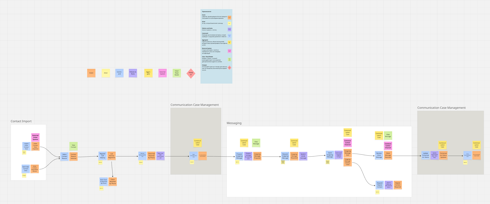

# CCMS — Communication Case Management System

CCMS is a project designed to demonstrate Domain-Driven Design, Clean Architecture, and ports/adapters in a realistic business domain.

The system helps a small service center manage follow-up communication with customers when a phone call was missed or when additional contact is required.

## Main idea

The core concept of the system is a **Communication Case**.

A `CommunicationCase` represents one communication process with a specific customer for a specific reason, linked to an external order. It keeps the current status and communication history, including call attempts and messages.

## What is implemented

- Open communication case
- Get communication case by id
- Search and list communication cases
- Register call attempt
- Send outgoing message
- Receive incoming message
- Close communication case
- PostgreSQL persistence with Liquibase
- In-memory and JDBC runtime profiles
- Messaging integration via ports/adapters
- Stub messaging adapter
- HTTP messaging adapter
- Fake external messaging provider for integration demo

## Architecture

The project follows a **modular monolith** approach with clear separation between:

- `domain`
- `application`
- `infrastructure`
- `web`

The central aggregate root is `CommunicationCase`.

## Run profiles

Available profile combinations:

- `in-memory,stub-messaging`  
  Run without database, using in-memory storage and stub messaging adapter.

- `jdbc,stub-messaging`  
  Run with PostgreSQL persistence and stub messaging adapter.

- `jdbc,http-messaging,fake-provider`  
  Run with PostgreSQL persistence, HTTP messaging adapter, and fake provider API for end-to-end integration flow.

## How to run

1. Configure PostgreSQL.
2. Set active Spring profiles.
3. Start the application.

Example:

```yaml
spring:
  profiles:
    active: jdbc,http-messaging,fake-provider

```
